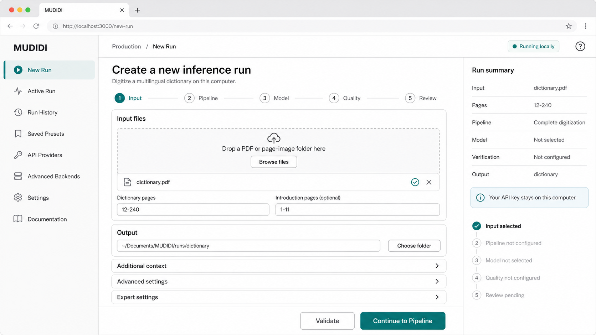

# Local Web Application UX Specification

This document specifies user-visible screens. Labels may be refined during
implementation, but the workflow and safety behavior are requirements.

## Application shell

The desktop layout uses a fixed left navigation, compact header, central work
area, and optional right summary rail. The generated baseline wireframe is
stored at `assets/new-run-wireframe.png`.



The New Run wizard retains entered values when moving backward. Validation
errors appear next to the relevant field and in a concise page summary.

## Input

Fields:

- PDF or page-image directory
- dictionary page range for PDF input
- optional introduction page range for PDF input
- output directory
- collapsible additional context inputs

The browser cannot expose arbitrary filesystem access. The implementation must
support local file upload and explicit local paths; native file dialogs are a
later desktop-wrapper concern. Large uploads remain on the same computer but
may be copied into app-managed storage.

## Pipeline

Three primary cards:

| Choice | Internal stage | Meaning |
|---|---|---|
| Complete digitization | `all` | Stage 1, parse rules, approval, Stage 2 |
| Transcription only | `1` | Stage 1 text only |
| Structure existing transcription | `2` | Existing Stage 1 text to MDF |

Advanced choices may expose discovery-only (`2-pass-1`), which finishes at the
review checkpoint. The UI never offers direct `2-pass-2`; Pass 2 starts only
from an approved review or an authorized resume.

Stage 1 options are conditionally visible: flat/column mode, typography,
introduction, alphabet, OCR hint, and guide file.

When Stage 2 is selected, users choose either:

- discover parse rules from representative pages, or
- load an existing parse-rules file for review.

Representative pages are selected as removable page chips with thumbnail and
Stage 1-text previews where available. The UI recommends two or three pages
covering ordinary entries, multiple senses, subentries, and abbreviations.

## Model

The default form selects one provider and model for all stages. A switch reveals
Stage 1, Pass 1, Pass 2, evaluator, and rewriter overrides.

Each picker groups:

- Recommended and tested
- Available to this API key
- Custom model identifier

Provider API-key state is shown without revealing stored values. Failed model
discovery must not block custom entry or the bundled fallback catalog.

Stage 1 requires known image capability. Unknown custom models remain selectable
with a warning that image and structured-output support cannot be verified.

## Quality

Presets:

- Standard: no agentic verification.
- Verified: verify both selected stages with two correction iterations.
- Custom: stage toggles, iteration budget, evaluator/rewriter models and
  reasoning, minimum confidence, deterministic patch toggle, and
  concrete-evidence gate.

The page states that verification can add LLM calls and cost. Catastrophic
recovery and patch count are informational behavior, not controls.

## Review

The pre-run screen summarizes input, pipeline, context, models, quality,
estimated page count, output, and parse-rule approval requirement. It runs path,
model, credential, and cross-field validation.

If an output run exists, present explicit choices: resume, choose another
directory, or delete and start over. Destructive deletion requires confirmation
and must never be inferred from a generic overwrite checkbox.

## Active Run

Tabs:

```text
Overview | Parse Rules | Pages | Live Logs | Outputs | Usage
```

Overview shows stage progress, current page, elapsed time, models, recent events,
token usage, cost, and cancel/open-output actions.

Pages shows per-page Stage 1, verification, and Stage 2 state. A page detail view
shows the source image, transcription, verifier attempts and applied patches,
and MDF result when available.

Live Logs defaults to human-readable events. Raw logs are an expert disclosure.
Usage groups calls, tokens, cache usage, corrections, and estimated cost by
model and stage.

## Parse Rules

The tab is present from run creation whenever Stage 2 is selected. It has four
states:

1. Waiting for prerequisite Stage 1/sample pages.
2. Discovering.
3. Review required.
4. Approved and used by Stage 2.

The review editor maps directly to `DictionaryMarkerCheatsheet`:

- dictionary name
- editable marker/description table
- reorderable structure-rule list
- abbreviation key/value table
- representative-page evidence viewer

Actions:

- Reset generated version
- Change sample pages and regenerate, with LLM-cost warning
- Save draft
- Validate
- Approve and continue

Validation uses the Pydantic schema plus UI checks for empty or duplicate marker
names. Approval saves an immutable approved snapshot and starts Pass 2. Closing
the browser or server never implies approval.

## Run History

The history table filters by query, status, pipeline, provider, and date. Rows
show name/input, pipeline, status, progress, model, cost, and last update.

Actions are context sensitive: view, resume, review parse rules, duplicate
settings, open output, cancel, or delete the history record. Deleting history
does not delete outputs without a second explicit action.

Runs in `awaiting_parse_rules_review` are prominent and open directly to the
Parse Rules tab. The state survives application restart.

## Accessibility and responsive behavior

- Semantic labels, visible focus, keyboard-operable disclosures and dialogs
- Status conveyed by text and icon, never color alone
- Form errors associated with fields
- Desktop-first layout; tablet collapses the summary rail
- Mobile is supported for monitoring and approval, but large-file setup may
  direct the user to desktop
